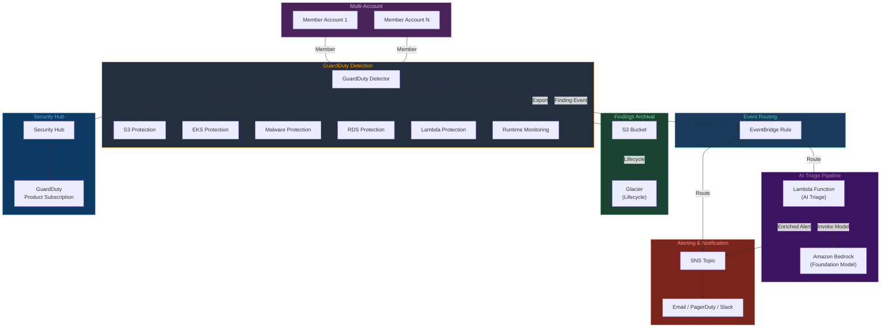
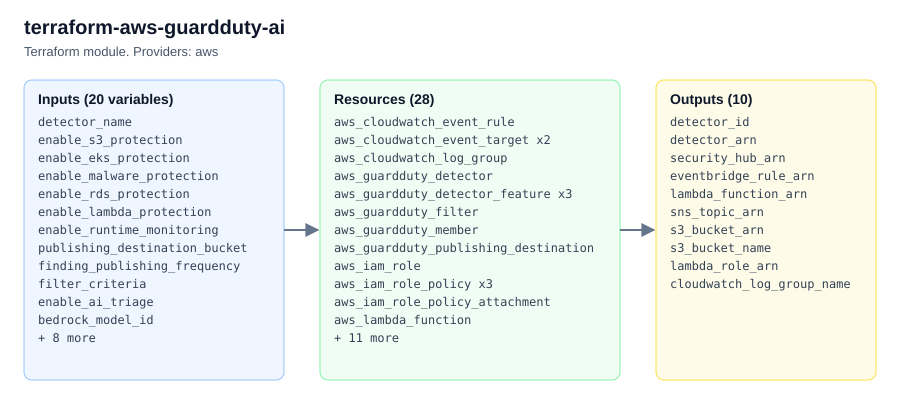

# terraform-aws-guardduty-ai

Terraform module for deploying **AWS GuardDuty with AI-enhanced threat detection**. This module provisions a GuardDuty detector with all protection plans, an AI-powered triage pipeline that uses Amazon Bedrock to analyze findings, EventBridge routing, SNS alerting, Security Hub integration, and S3-based findings archival.

---

## Architecture



---

## Documentation

- [What is Amazon GuardDuty?](https://docs.aws.amazon.com/guardduty/latest/ug/what-is-guardduty.html)
- [Remediating GuardDuty Findings](https://docs.aws.amazon.com/guardduty/latest/ug/guardduty_remediate.html)
- [Terraform aws_guardduty_detector Resource](https://registry.terraform.io/providers/hashicorp/aws/latest/docs/resources/guardduty_detector)

---

## Prerequisites

1. **Terraform** >= 1.5.0
2. **AWS Provider** >= 5.40.0
3. **AWS CLI** configured with credentials that have permissions for GuardDuty, Security Hub, EventBridge, Lambda, S3, SNS, IAM, and CloudWatch.
4. **Amazon Bedrock model access** enabled for the chosen `bedrock_model_id` (required only when `enable_ai_triage = true`).
5. GuardDuty must not already be enabled in the target account and region (only one detector per region per account is allowed).
6. If using Security Hub, it must not already be enabled in the target account/region.

---

## Usage Example

```hcl
module "guardduty_ai" {
  source = "github.com/kogunlowo123/terraform-aws-guardduty-ai"

  detector_name = "prod-security"

  # Protection plans
  enable_s3_protection      = true
  enable_eks_protection     = true
  enable_malware_protection = true
  enable_rds_protection     = true
  enable_lambda_protection  = true
  enable_runtime_monitoring = true

  # Findings configuration
  finding_publishing_frequency = "FIFTEEN_MINUTES"

  # AI triage
  enable_ai_triage = true
  bedrock_model_id = "anthropic.claude-3-sonnet-20240229-v1:0"

  # Security Hub
  enable_security_hub = true

  # Filters - auto-archive known benign patterns
  filter_criteria = [
    {
      name        = "archive-dns-benign"
      description = "Archive low-severity DNS findings from known services"
      action      = "ARCHIVE"
      rank        = 1
      criterion = [
        {
          field  = "severity"
          less_than = "4"
        },
        {
          field  = "type"
          equals = ["Recon:EC2/Portscan"]
        }
      ]
    }
  ]

  # Multi-account (optional)
  member_accounts = [
    {
      account_id = "111111111111"
      email      = "security-dev@example.com"
    },
    {
      account_id = "222222222222"
      email      = "security-staging@example.com"
    }
  ]

  tags = {
    Environment = "production"
    Team        = "security"
    ManagedBy   = "terraform"
  }
}
```

---

## Deployment Guide

### Step 1 -- Prepare the Environment

```bash
git clone https://github.com/kogunlowo123/terraform-aws-guardduty-ai.git
cd terraform-aws-guardduty-ai

aws sts get-caller-identity
```

### Step 2 -- Enable Bedrock Model Access (if using AI triage)

Open the [Amazon Bedrock console](https://console.aws.amazon.com/bedrock/) and request access for the foundation model specified in `bedrock_model_id`.

### Step 3 -- Create a Terraform Configuration

Create a `main.tf` in your working directory that calls this module (see the usage example above).

### Step 4 -- Initialize and Plan

```bash
terraform init
terraform plan -out=tfplan
```

Review the plan carefully. Confirm that GuardDuty is not already enabled in the target account/region.

### Step 5 -- Apply

```bash
terraform apply tfplan
```

### Step 6 -- Subscribe to SNS Notifications

After the apply completes, subscribe your alerting endpoints to the SNS topic:

```bash
aws sns subscribe \
  --topic-arn <sns_topic_arn> \
  --protocol email \
  --notification-endpoint security-team@example.com
```

### Step 7 -- Verify the Detector

```bash
aws guardduty list-detectors
aws guardduty get-detector --detector-id <detector_id>
```

### Step 8 -- Generate a Test Finding

```bash
aws guardduty create-sample-findings \
  --detector-id <detector_id> \
  --finding-types "Recon:EC2/PortProbeUnprotectedPort"
```

Check your SNS subscription and CloudWatch Logs for the AI-enriched analysis.

---

## Inputs

| Name | Description | Type | Default | Required |
|------|-------------|------|---------|----------|
| `detector_name` | Logical name for naming related resources | `string` | n/a | yes |
| `enable_s3_protection` | Enable S3 Protection | `bool` | `true` | no |
| `enable_eks_protection` | Enable EKS Audit Log Monitoring | `bool` | `true` | no |
| `enable_malware_protection` | Enable Malware Protection for EBS | `bool` | `true` | no |
| `enable_rds_protection` | Enable RDS Login Activity Monitoring | `bool` | `true` | no |
| `enable_lambda_protection` | Enable Lambda Network Activity Monitoring | `bool` | `true` | no |
| `enable_runtime_monitoring` | Enable Runtime Monitoring | `bool` | `true` | no |
| `publishing_destination_bucket` | S3 bucket name for findings export (auto-created if empty) | `string` | `""` | no |
| `finding_publishing_frequency` | Publishing frequency (FIFTEEN_MINUTES, ONE_HOUR, SIX_HOURS) | `string` | `"FIFTEEN_MINUTES"` | no |
| `filter_criteria` | List of custom GuardDuty filter configurations | `list(object)` | `[]` | no |
| `enable_ai_triage` | Enable AI-powered triage via Lambda and Bedrock | `bool` | `true` | no |
| `bedrock_model_id` | Bedrock model ID for AI triage | `string` | `"anthropic.claude-3-sonnet-20240229-v1:0"` | no |
| `sns_topic_name` | SNS topic name for alerts (auto-generated if empty) | `string` | `""` | no |
| `enable_security_hub` | Enable Security Hub with GuardDuty subscription | `bool` | `true` | no |
| `member_accounts` | List of member account configurations | `list(object)` | `[]` | no |
| `lambda_log_retention_days` | CloudWatch log retention in days | `number` | `30` | no |
| `lambda_timeout` | Lambda function timeout in seconds | `number` | `120` | no |
| `lambda_memory_size` | Lambda function memory in MB | `number` | `512` | no |
| `findings_archive_lifecycle_days` | Days before transitioning to Glacier | `number` | `90` | no |
| `tags` | Map of tags for all resources | `map(string)` | `{}` | no |

## Outputs

| Name | Description |
|------|-------------|
| `detector_id` | The ID of the GuardDuty detector |
| `detector_arn` | The ARN of the GuardDuty detector |
| `security_hub_arn` | The ARN of the Security Hub account (if enabled) |
| `eventbridge_rule_arn` | The ARN of the EventBridge rule |
| `lambda_function_arn` | The ARN of the AI triage Lambda (if enabled) |
| `sns_topic_arn` | The ARN of the SNS topic |
| `s3_bucket_arn` | The ARN of the findings archive S3 bucket |
| `s3_bucket_name` | The name of the findings archive S3 bucket |
| `lambda_role_arn` | The ARN of the Lambda execution role (if enabled) |
| `cloudwatch_log_group_name` | The CloudWatch log group name (if enabled) |

---

## License

MIT License. See [LICENSE](LICENSE) for details.

<!-- project-structure -->
## Project structure

```text
├── .github/
├── docs/
│   └── architecture.html
├── examples/
│   └── complete/
├── lambdas/
│   └── ai_triage_handler.py
├── tests/
│   ├── main.tf
│   ├── outputs.tf
│   └── providers.tf
├── .editorconfig
├── .gitattributes
├── .pre-commit-config.yaml
├── CHANGELOG.md
├── CODEOWNERS
├── CONTRIBUTING.md
├── LICENSE
├── README.md
├── SECURITY.md
├── main.tf
├── outputs.tf
├── variables.tf
└── versions.tf
```

<!-- architecture -->
## Architecture


